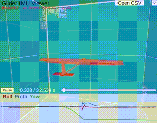

# GliderIMUViewer

GliderIMUViewer is a Unity-based application for visualizing Inertial Measurement Unit (IMU) pose data from CSV files. It provides interactive graph visualization of roll, pitch, and yaw angles with real-time playback capabilities.
It can also show the attitude **live** from telemetry received over UDP (see [Realtime UDP Preview](#realtime-udp-preview)).



## Quick Start

**Pre-built Windows executable is available in [Releases](https://github.com/sassa4771/GliderIMUViewer/releases)** - Download and run immediately without Unity installation!

## Overview

This application enables researchers, engineers, and developers to analyze and visualize orientation data captured from IMU sensors, particularly those used in glider or aircraft applications. The viewer supports multiple coordinate systems, angle units (degrees/radians), and deploys across multiple platforms including Windows, macOS, Linux standalone builds, and WebGL.

### Integration with espnow-uart-bridge

This viewer works seamlessly with [espnow-uart-bridge](https://github.com/sassa4771/espnow-uart-bridge) for wireless IMU data collection. The espnow-uart-bridge project enables ESP-NOW wireless communication between ESP32 devices and outputs IMU data in CSV format compatible with GliderIMUViewer.

## Features

- **CSV File Loading**: Load IMU pose data from CSV files with cross-platform file dialog support
- **Interactive Graph Visualization**: Display roll, pitch, and yaw angles as time-series graphs
- **Real-time Playback**: Control playback timing with visual cursor tracking
- **Realtime UDP Preview**: Show the attitude live from telemetry received over UDP (glider serial lines, JSON or OSC) in the `RealtimePreview` scene
- **Flexible Data Format**: Support for various CSV formats with configurable column names
- **Angle Unit Detection**: Automatic detection of degrees vs radians
- **Coordinate System Mapping**: Configurable axis mapping and sign conventions
- **Multi-Platform Support**: 
  - Unity Editor (EditorUtility.OpenFilePanel)
  - Windows (Ookii.Dialogs / System.Windows.Forms)
  - macOS (NSOpenPanel/NSSavePanel via Objective-C)
  - Linux (GTK-based dialogs)
  - WebGL (JavaScript file picker with Base64 encoding)

## Requirements

- Unity 2022.3 or later
- Universal Render Pipeline (URP) 17.0.4
- Unity Input System 1.14.0
- TextMeshPro

## Project Structure

```
Assets/
├── Scenes/
│   ├── KinematicPreview.unity      # Main IMU visualization scene
│   ├── RealtimePreview.unity       # Live attitude display from UDP telemetry
│   └── FlightSimulation.unity      # Flight simulation scene
├── Scripts/
│   ├── CsvOpenDialogButton.cs      # File selection UI component
│   ├── KinematicPreview/
│   │   ├── PoseCsvStore.cs         # CSV data loading and management
│   │   ├── PoseGraphView.cs        # Graph visualization component
│   │   ├── PosePlaybackController.cs  # Playback control
│   │   ├── PoseApplier.cs          # Apply pose to 3D objects
│   │   ├── OrbitAroundOrigin.cs    # Camera orbit control
│   │   └── UIShowHide.cs           # UI visibility control
│   ├── RealtimePreview/
│   │   ├── UdpTelemetryReceiver.cs # UDP reception
│   │   ├── TelemetryParser.cs      # DAT/HDR/LOG lines, JSON, OSC and CSV parsing
│   │   ├── AttitudeMath.cs         # roll/pitch/yaw <-> rotation, axis mapping
│   │   ├── RealtimePoseStore.cs    # Latest pose, zeroing, history, statistics
│   │   ├── RealtimePoseApplier.cs  # Apply pose to 3D objects
│   │   ├── RealtimeGraphView.cs    # Scrolling graph
│   │   └── RealtimeHud.cs          # Status display and controls
│   └── FlightSimulation/
│       ├── GliderAero.cs           # Glider aerodynamics
│       ├── GliderKinematicByPlayback.cs  # Playback-based kinematics
│       └── LocalZInputMover.cs     # Input-based movement
├── Plugins/
│   └── WebGL/
│       └── FilePicker.jslib        # WebGL file picker implementation
├── StandaloneFileBrowser/          # Cross-platform file browser library
├── StreamingAssets/                # Sample CSV files
└── Settings/
    └── Mobile_RPAsset.asset        # URP rendering configuration
Tools/
├── udp_test_sender.py              # Test sender for the RealtimePreview scene (no hardware needed)
└── serial_udp_bridge.py            # Forwards the glider's serial lines to UDP
Docs/
├── RealtimeUdp_ja.md               # Guide for the sender side of the RealtimePreview scene (Japanese)
└── viewer_serialsend_udp.patch     # Reference patch for the glider repository's viewer
```

## CSV File Format

The application expects CSV files with the following structure:

### Required Columns

**IMPORTANT: Column names must match exactly** (case-insensitive). The default expected column names are:

- **Time column**: `t_ms` (time in milliseconds) **OR** `dt_ms` (delta time in milliseconds)
  - If using `t_ms`: Absolute timestamp in milliseconds (e.g., 0, 10, 20, 30...)
  - If using `dt_ms`: Time increment in milliseconds between rows (e.g., 10, 10, 10...)
- **Angle columns**: `roll`, `pitch`, `yaw`
  - These exact names are required by default
  - Angles can be in degrees or radians (auto-detected or manually configured)

### Optional Columns

- **Acceleration**: `ax`, `ay`, `az` (in m/s² or G)
- **Custom columns**: Any additional numeric or string columns

### Example CSV Format

```csv
t_ms,roll,pitch,yaw,ax,ay,az
0,0.0,0.0,0.0,0.0,0.0,9.81
10,0.5,0.2,0.1,0.1,0.0,9.80
20,1.0,0.4,0.2,0.2,0.0,9.79
...
```

### Custom Column Names

If your CSV uses different column names, you can configure them in the Unity Editor:

1. Select the GameObject with the `PoseCsvStore` component
2. In the Inspector, under "CSV" section, modify:
   - `Time Column` (default: "t_ms")
   - `Dt Column` (default: "dt_ms")
   - `Roll Column` (default: "roll")
   - `Pitch Column` (default: "pitch")
   - `Yaw Column` (default: "yaw")
   - `Ax Column`, `Ay Column`, `Az Column` for acceleration (optional)

### Configuration Options

The `PoseCsvStore` component provides extensive configuration:

- **Column Names**: Customize column names for time, angles, and acceleration
- **Delimiter**: Configure CSV delimiter (default: comma)
- **Angle Units**: Auto-detect or manually specify degrees/radians
- **Axis Mapping**: Map roll/pitch/yaw to X/Y/Z axes
- **Sign Convention**: Configure sign multipliers for each axis
- **Normalization**: Option to zero angles at start
- **Acceleration Units**: Support for m/s² or G units

## Getting Started

### Opening the Project

1. Clone this repository
2. Open the project in Unity 2022.3 or later
3. Open the `KinematicPreview` scene from `Assets/Scenes/`

### Loading CSV Data

#### Method 1: Using the UI Button

1. Run the scene in Unity Editor or build the application
2. Click the "Open CSV" button
3. Select your CSV file from the file dialog
4. The graph will automatically update with the loaded data

#### Method 2: Using StreamingAssets

1. Place your CSV file in `Assets/StreamingAssets/`
2. In the `PoseCsvStore` component:
   - Enable "Use Streaming Assets Path"
   - Set "File Path" to your CSV filename
   - Enable "Load On Start"
3. Run the scene

### Configuring Data Import

Select the GameObject with the `PoseCsvStore` component and configure:

1. **CSV Settings**:
   - Set column names to match your CSV file
   - Configure delimiter if not using comma
   
2. **Angle Units & Axis Map**:
   - Enable "Auto Detect Angle Units" or manually specify
   - Map roll/pitch/yaw to appropriate axes
   - Set sign multipliers if needed

3. **Normalization**:
   - Enable "Zero At Start" to subtract initial pose

## Realtime UDP Preview

`Assets/Scenes/RealtimePreview.unity` shows the attitude of a glider **live**. Instead of loading a CSV file it listens on a UDP port and applies every received roll / pitch / yaw sample to the 3D model, with a scrolling graph and a status display.

```
glider (XIAO + ESP32) --ESP-NOW--> ground ESP32 --USB serial--> Python on the PC --UDP--> Unity (RealtimePreview)
```

It is designed to be fed by the Python tools of [Glider-Control_Cluster-Comunication](https://github.com/IPTeCA/Glider-Control_Cluster-Comunication), but anything that can send a UDP datagram works. A guide for the sender side (in Japanese) is in [Docs/RealtimeUdp_ja.md](Docs/RealtimeUdp_ja.md).

### Quick start (no hardware needed)

1. Open `Assets/Scenes/RealtimePreview.unity` and press Play. The status line shows `WAITING  UDP port 9000`.
2. In a terminal, run the bundled test sender (Python 3.10+, standard library only):
   ```bash
   python Tools/udp_test_sender.py
   ```
3. The model starts moving and the status line changes to `LIVE  30.0 Hz  from 127.0.0.1:... [DAT]`.

### What to send

Send **one message per datagram** to UDP port 9000 of the PC running Unity. The format is detected per datagram:

| Format | Example payload | Notes |
|---|---|---|
| Glider serial lines, unchanged | `DAT,1234,56789,33.0,0.01,...`<br>`HDR,1,GLDR,fields=dt_ms,ax,...`<br>`LOG,mode:Manual` | Recommended. Values are named by the last `HDR` (`fields=`). Until an `HDR` arrives, `dt_ms,ax,ay,az,gx,gy,gz,roll,pitch,yaw,s0,s1,s2` is assumed, so re-send `HDR` every few seconds |
| JSON | `{"seq":1234,"t_ms":56789,"roll":1.5,"pitch":-2.3,"yaw":180.0}` | Named values. `seq` and `t_ms` are optional. `{"log":"text"}` for log lines |
| OSC | `/plane/data` with floats `roll pitch yaw sv1 sv3` | What `viewer_serialsend.py --osc-ip <PC> --osc-port 9000` already sends. Only the address `/plane/data` is accepted by default |
| Numbers only | `1.5,-2.3,180.0` | By position: roll, pitch, yaw (at least three numbers) |
| key:value | `roll:1.5,pitch:-2.3,yaw:180.0` | |

Angles are in degrees. A minimal Python sender:

```python
import socket
sock = socket.socket(socket.AF_INET, socket.SOCK_DGRAM)
sock.sendto(line.encode("utf-8"), ("127.0.0.1", 9000))   # line = "DAT,..." exactly as read from the serial port
```

[Docs/viewer_serialsend_udp.patch](Docs/viewer_serialsend_udp.patch) adds this (`--udp-ip` / `--udp-port`) to `viewer_serialsend.py` of the glider repository.

> The "Cluster OSC" output of `logger_gui.py` does **not** carry attitude with the current `DAT` firmware (it sends the first five numbers of each line: `seq, t_ms, dt_ms, ax, ay`). The viewer rejects such values and shows `NO ATTITUDE ... values out of range`.

### Bundled Python tools (`Tools/`)

| Script | Purpose |
|---|---|
| `udp_test_sender.py` | Sends synthetic glider-like motion, or replays a recorded CSV in real time (`--csv Assets/StreamingAssets/out_20250912-152517.csv --loop`). Formats: `--format dat|json|osc|csv`. Can simulate a bad link (`--loss 0.1 --jitter-ms 30 --burst 3`) |
| `serial_udp_bridge.py` | Reads the `HDR` / `DAT` / `LOG` lines from the ground ESP32's serial port and forwards each one as a UDP datagram (`--serial COM3 [--host <PC> --port 9000]`). Requires `pip install pyserial`. Only one program can open a COM port, so close other serial viewers first |

### Controls

| Control | Action |
|---|---|
| `Pause` button / Space | Freeze / resume the display (reception continues) |
| `Zero` button / Z | Take the current heading as 0 (in `Level` mode, also take the current tilt as level) |
| `Zero: Yaw` button | Cycle the zero mode: `Yaw` (only the heading is zeroed; roll and pitch stay as received) → `Level` (additionally, the tilt at the moment of `Zero` counts as level: put the glider level and press `Zero` to cancel a tilted IMU mounting) → `Off` (values as received) |
| `IMU X: tail` button | Cycle the IMU mounting / axis mapping: `IMU X: tail` → `IMU X: nose` → `Legacy map` (see below) |
| Click the `Roll` / `Pitch` / `Yaw` label | Show / hide that line in the graph (e.g. hide yaw to see roll and pitch in more detail) |
| `UDP port` + `Set` | Listen on another port (remembered in builds) |
| F1 / the button at the top right | Hide / show the UI |
| Drag / mouse wheel | Orbit / zoom the camera |

The status line shows `WAITING` (nothing received yet), `LIVE <rate> from <sender> [format]`, `NO DATA <seconds>` (stream interrupted; the model keeps its last pose), `NO ATTITUDE <reason>` (datagrams arrive but cannot be used as roll / pitch / yaw) or `ERROR` (for example when the port is already used by another application).

### Axis mapping (IMU mounting)

The glider model has its fuselage along Z (nose at -Z), its wing span along X and up along Y. The viewer composes the rotation as yaw → pitch → roll, which is how the firmware's Madgwick filter defines its angles, and rotates **roll about the fuselage axis** and **pitch about the wing-span axis**. Which way positive roll and pitch go depends on how the IMU is mounted:

| Button | IMU mounting | Check with the real glider |
|---|---|---|
| `IMU X: tail` (default) | +X toward the tail (current firmware: `ax` goes negative at launch) | nose up → pitch increases; right wing down → roll decreases |
| `IMU X: nose` | +X toward the nose (the hardware that recorded the sample CSV) | nose up → pitch decreases; right wing down → roll increases |
| `Legacy map` | Same assignment and composition as the KinematicPreview scene (roll→X, pitch→Z, yaw→Y, `Quaternion.Euler`) | Looks exactly like CSV playback |

Hold the glider, raise its nose, then lower its right wing: if the model does the same, the mapping is right. Note that the KinematicPreview mapping rotates roll about the wing-span axis of this model, so with a fuselage-aligned IMU roll and pitch appear swapped there; `Legacy map` exists for parity with that scene.

In builds the selected mapping is remembered. In the Editor, set the default with the context menu of the `RealtimePoseStore` component (`Axis preset: ...`) or edit its `Axis Map`, and save the scene.

### Settings

Select the objects in the scene to adjust them in the Inspector:

- **UdpTelemetryReceiver**: `Port`, default field names for `DAT` lines without `HDR`, field order for positional formats (OSC / numbers only), `Osc Address Filter`, `Log Unparsed` for debugging a sender.
- **RealtimePoseStore**: field names, degrees / radians, `Axis Map`, `Compose Order`, `Zero Mode` (also `Relative`: the rotation relative to the zero pose, the same calculation as `zeroAtStart` in KinematicPreview), sanity limit for angles (`Max Abs Angle`).
- **RealtimePoseApplier** (on the glider model): `Smoothing Time`.
- **RealtimeGraphView**: time window (default 30 s), fixed or automatic Y range.

### Notes

- UDP reception needs the Editor or a standalone build. **WebGL builds cannot receive UDP**; the scene then only shows an error message.
- The scene is not in the build scene list. To build a realtime viewer, add `RealtimePreview` in *File > Build Profiles* (*Build Settings* in older Unity versions) and put it first to make it the start scene.
- Sending from the same PC (`127.0.0.1`) needs no firewall change. When sending from another PC, use the address shown after `this PC:` in the status line; the firewall of the receiving PC must allow inbound UDP for the Unity Editor or the built application. The Unity Editor often has an inbound *Block* rule for "Public" networks (`Unity <version> Editor` in the Windows Firewall inbound rules): switch the network to "Private" or change that rule.
- Yaw from an IMU without magnetometer drifts; press `Zero` to re-align the heading.

## Key Components

### PoseCsvStore

Central data store for loading, parsing, and managing pose CSV data. Provides:

- `LoadFromAbsolutePath(string path)`: Load CSV from absolute file path
- `EvaluateQuat(float time)`: Get interpolated pose quaternion at given time
- `GetSnapshot(out float[] times, out Vector3[] eulersDeg)`: Get complete time series data
- Events: `Loaded`, `LoadFailed`

### PoseGraphView

Unity UI Graphic component that renders pose data as interactive graphs:

- Displays roll, pitch, and yaw as colored line series
- Real-time playback cursor
- Auto-scaling or fixed Y-axis range
- Configurable colors and line thickness

### CsvOpenDialogButton

UI component managing cross-platform file selection:

- Handles platform-specific file dialog implementations
- Validates file selection and extension
- Provides status feedback
- Remembers last directory

### PosePlaybackController

Manages playback timing and animation state:

- Play/pause control
- Time scrubbing
- Playback speed adjustment
- Loop control

## Building the Application

### Standalone Builds (Windows/macOS/Linux)

1. Go to File > Build Settings
2. Select your target platform
3. Add the `KinematicPreview` scene
4. Click "Build" or "Build and Run"

The standalone file browser will use native OS dialogs.

### WebGL Build

1. Go to File > Build Settings
2. Select "WebGL" platform
3. Add the `KinematicPreview` scene
4. Click "Build"

The WebGL build uses JavaScript file picker with Base64 encoding for file loading.

## Platform-Specific Notes

### Windows
Uses `StandaloneFileBrowser` with Windows Forms dialogs.

### macOS
Uses native `NSOpenPanel`/`NSSavePanel` through Objective-C bundle.

### Linux
Uses GTK-based dialogs through native library.

### WebGL
- File selection uses browser's native file picker
- Files are loaded via Base64 encoding
- No direct file system access

## Sample Data

A sample CSV file is included in `Assets/StreamingAssets/out_20250912-152517.csv` for testing purposes.

## Troubleshooting

### CSV Not Loading

- Check that column names in `PoseCsvStore` match your CSV headers
- Verify delimiter setting matches your CSV format
- Ensure time column exists (either `t_ms` or `dt_ms`)
- Check Unity Console for error messages

### Angles Look Wrong

- Try toggling "Auto Detect Angle Units"
- Verify axis mapping (rollAxis, pitchAxis, yawAxis)
- Check sign multipliers (rollSign, pitchSign, yawSign)
- Enable "Zero At Start" if initial pose should be identity

### File Dialog Not Working

- **Editor**: Should always work with EditorUtility
- **Standalone**: Ensure StandaloneFileBrowser plugins are properly imported
- **WebGL**: Must be running in browser, not Unity Editor

## License

This project uses the following third-party libraries:

- **StandaloneFileBrowser**: Cross-platform file browser for Unity
- **TextMeshPro**: Unity's text rendering solution
- **Universal Render Pipeline**: Unity's scriptable render pipeline

## Version

Current version: 1.1.0

## Unity Version

Built with Unity 2022.3 LTS using Universal Render Pipeline.
